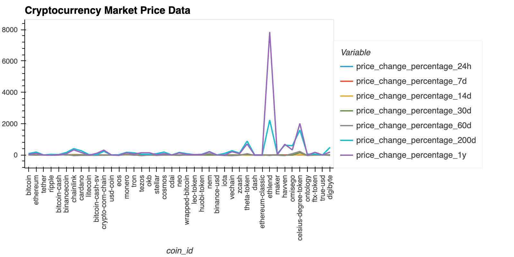

# Cryptocurrencies Clustering 

Application of Unsupervised machine learning to cluster cryptocurrencies in a portfolio, from crypto market data based on their periodic performance metrics in a jupyter notebook using scikit-learn library from Python.

## Analysis and steps followed:

### * Clustering with the original data (before using optimization techniques)



1. Data in the form of a CSV file is imported and used as dataframe, which contains percentage of price change in different time periods:
`price_change_percentage_24h`,`price_change_percentage_7d`,`price_change_percentage_14d`, `price_change_percentage_30d`, `price_change_percentage_60d` for different cryptocurrency `coin-id`.

2. The data is then prepared and scaled using scikit-learn `StandardScaler().fit_transform` to find the best value of `k` for clustering using`elbow curve`.
`The best value for k is where the curve flattens out like an elbow.`

3. A line chart with all the inertia values computed with the different values of k (using loop method)is plotted to visualize the optimum value of `k` which comes as 4 in this case.

4. Using `K-means model` and best value for k (found in the previous section), we cluster the cryptocurrencies according to the price changes of cryptocurrencies provided and create a scatter plot to see the clusters.

### * Clustering with the PCA data (after using optimization techniques and PCA)

1. Perform a `principal component analysis (PCA)` and reduce the features to three principal components to optimize the clusters.

2. Obtain the explained variance to determine how much information can be attributed to each principal component using `explained_variance_ratio_` and adding the values, which comes as 90% in this data.

3. Create a new DataFrame with the PCA data setting `coin_id` index from the original DataFrame as the index for the new DataFrame.

4. Code the elbow method algorithm using the PCA data to find the best value for k and plot a line chart with all the inertia values computed with the different values of k to visually identify the optimal value for `k` which comes as 4 again.

5. Using `K-means model`with four clusters (best value for k), predict the clusters to group the cryptocurrencies by using the PCA data and create a scatter plot.

### * Visualize and Compare the Results

1. Create a composite plot to compare the elbow curve of the original data and the PCA data.


2. Create a composite plot to compare the cryptocurrencies clusters using the original data and the PCA data.


#### Analysis:
Visually analyzing the cluster analysis results, we observe the impact of using fewer features to cluster the data using K-Means is `increased interpretability` of the cryptocurrency data and clusters. With PCA, we reduced the number of features for the data to 3 without sacrificing much in terms of accuracy, wherein the explained variance is 90%.
Despite some accuracy loss because of dimensionality reduction, the plots have become easier to visualize this time, as compared to the plot generated from the K-means algorithm with original data with multiple features, as we now have only three features.
PCA allowed us to shrink the number of variables used in the K-Means algorithm, without sacrificing much in terms of accuracy.

## Technologies and Modules

This tool leverages python 3.7 with the following packages:

* [pandas] (https://pandas.pydata.org/docs/getting_started/index.html)- for data analysis
* [jupyter lab] (https://jupyterlab.readthedocs.io/en/stable/)- to work with notebooks, code, data and plots
* [hvplot] (https://hvplot.holoviz.org/user_guide/Introduction.html)- to display an interactively explorable plot
* [scikit-learn] (https://scikit-learn.org/stable/)- open source machine learning library
* [pathlib] (https://docs.python.org/3/library/pathlib.html#module-pathlib)

## Installation Guide

```
conda install pandas
pip install jupyterlab
pip install hvplot
pip install -U scikit-learn
pip install pathlib

```

## Contributor

Shivangi Gupta

## License

MIT
